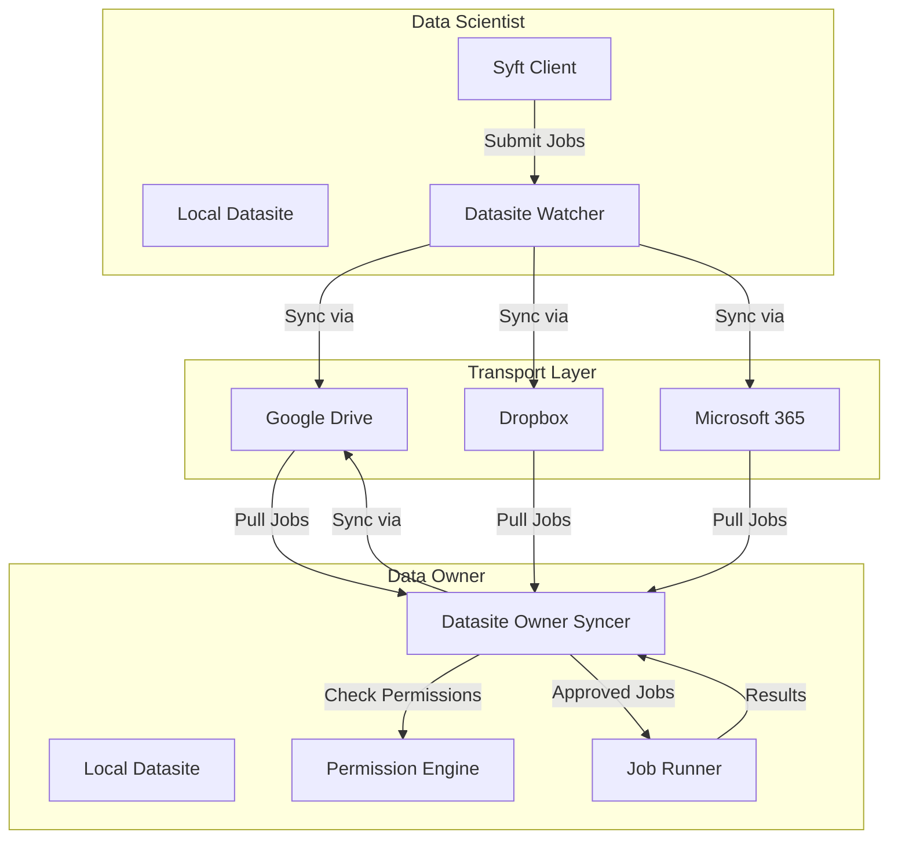

Syft Client is built on a **file-first**, **modular**, and **offline-first** architecture that enables peer-to-peer data science across decentralized networks.

## Core Architecture Principles

The system is designed around 18 core principles (see [principles.md](https://github.com/OpenMined/syft-client/blob/main/principles.md)). The most fundamental are:

<CardGroup cols={2}>
  <Card title="File First" icon="file">
    State is primarily described by files synced between peers. All other storage (databases, caches) is secondary and optional.
  </Card>
  <Card title="Offline First" icon="wifi-slash">
    Datasites can go offline/online freely. Messages are cached in transport layers until peers reconnect.
  </Card>
  <Card title="Shell First" icon="terminal">
    Functions are shell scripts (`run.sh`) inside resource folders. Minimal dependencies beyond filesystem + shell + internet.
  </Card>
  <Card title="Transport Agnostic" icon="arrows-rotate">
    Works with any transport layer (Google Drive, Dropbox, etc.). No lock-in to specific platforms.
  </Card>
</CardGroup>

## High-Level Architecture

Syft Client consists of several modular components that work together:



## Core Components

### 1. Datasite Syncers

Two main syncer components handle different roles:

#### Datasite Watcher Syncer

Handles the **data scientist** role - pushing proposed changes and pulling from peer outboxes.

<CodeGroup>
```python syft_client/sync/sync/datasite_watcher_syncer.py
class DatasiteWatcherSyncer(BaseModelCallbackMixin):
    """Handles both pushing proposed file changes and pulling from datasite outboxes."""
    
    def on_file_change(self, relative_path: Path | str, content: str | None = None):
        """Queue file changes for syncing to peers"""
        
    def sync_down(self, peer_emails: list[str]):
        """Pull messages and datasets from peer outboxes"""
```
</CodeGroup>

#### Datasite Owner Syncer

Handles the **data owner** role - downloading files and checking permissions.

<CodeGroup>
```python syft_client/sync/sync/datasite_owner_syncer.py
class DatasiteOwnerSyncer(BaseModelCallbackMixin):
    """Responsible for downloading files and checking permissions"""
    
    def sync(self, peer_emails: list[str], recompute_hashes: bool = True):
        """Pull proposed file changes and process them"""
        
    def check_write_permission(self, sender_email: str, path: str) -> bool:
        """Check if sender has write access to the given path"""
        
    def check_read_permissions(self, recipient_email: str, path: str) -> bool:
        """Check if recipient has read access to the given path"""
```
</CodeGroup>

### 2. Connection Router

Abstracts away transport layer details, allowing the same code to work with multiple platforms.

```python
class ConnectionRouter:
    """Routes connections to appropriate transport layers"""
    
    def send_proposed_file_changes_message(self, recipient: str, message: ProposedFileChangesMessage):
        """Send changes via configured transport layer"""
        
    def get_next_proposed_filechange_message(self, sender_email: str) -> ProposedFileChangesMessage | None:
        """Pull next message from inbox"""
```

See [Peer-to-Peer Network](/concepts/peer-to-peer) for transport layer details.

### 3. Event System

All state changes are represented as file change events:

<CodeGroup>
```python syft_client/sync/events/file_change_event.py
class FileChangeEvent(BaseModel):
    id: UUID
    path_in_datasite: Path
    datasite_email: str
    content: str | bytes | None  # None for deletions
    old_hash: str | None
    new_hash: str | None  # None for deletions
    is_deleted: bool
    submitted_timestamp: float
    timestamp: float
```
</CodeGroup>

Events are:
- **Immutable**: Once created, events never change
- **Ordered**: Timestamp-based ordering ensures consistency
- **Compressed**: Stored as `.tar.gz` files for efficiency
- **Cacheable**: Can be replayed to rebuild state

### 4. Permission Engine

File-based access control using `syft.pub.yaml` files. See [Permissions](/concepts/permissions) for details.

### 5. Job System

Shell-first job execution framework:

<CodeGroup>
```python packages/syft-job/src/syft_job/client.py
class JobClient:
    """Client for submitting jobs to SyftBox."""
    
    def submit_bash_job(self, user: str, script: str, job_name: str = "") -> Path:
        """Submit a bash job for a user"""
        
    def submit_python_job(self, user: str, code_path: str, job_name: str = "", 
                          dependencies: List[str] = None) -> Path:
        """Submit a Python job (wraps code in bash script)"""
```
</CodeGroup>

Jobs are folders containing:
- `run.sh` - The shell script to execute
- `config.yaml` - Job metadata (name, submitted_by, dependencies)
- Additional resources (Python files, data, etc.)
- Status markers: `approved`, `done`

## State Management

### File-First State

All state is stored as files on the local filesystem:

```
~/syftbox/
├── alice@example.com/           # Datasite
│   ├── public/                  # Public folder
│   │   ├── syft.pub.yaml       # Permission file
│   │   └── data.csv            # Shared data
│   ├── private/                 # Private folder
│   └── jobs/                    # Job queue
│       └── bob@example.com/     # Jobs from Bob
│           └── job_123/
│               ├── run.sh
│               ├── config.yaml
│               └── approved     # Status marker
└── .syftbox-events/            # Event cache (optional)
```

### Checkpointing System

To optimize sync performance, Syft uses a multi-tier checkpoint system:

<Steps>
  <Step title="Rolling State">
    In-memory accumulation of recent events. Uploaded to transport layer after threshold.
  </Step>
  <Step title="Incremental Checkpoints">
    Periodic snapshots of rolling state. Created when event count exceeds threshold (default: 50 events).
  </Step>
  <Step title="Full Checkpoints">
    Complete state snapshots. Created by compacting incremental checkpoints (default: after 10 incremental checkpoints).
  </Step>
</Steps>

```python
# From datasite_owner_syncer.py
def try_create_checkpoint(self, threshold: int = 50, compacting_threshold: int = 10):
    """Try to create incremental checkpoint and/or compact if thresholds exceeded."""
    if self.should_create_checkpoint(threshold):
        result = self.create_incremental_checkpoint()
        
        if self.should_compact_checkpoints(compacting_threshold):
            result = self.compact_checkpoints()  # Merge into full checkpoint
```

## Modular Package Structure

Syft Client is composed of optional modules:

<AccordionGroup>
  <Accordion title="syft-datasets" icon="database">
    Dataset management and sharing. Handles collections of files with permission tracking.
  </Accordion>
  
  <Accordion title="syft-job" icon="play">
    Job submission and execution. Shell-first computation framework.
  </Accordion>
  
  <Accordion title="syft-permissions" icon="shield">
    Permission system for datasites. File-first access control.
  </Accordion>
  
  <Accordion title="syft-perm" icon="key">
    User-facing permission API. High-level interface for granting/revoking access.
  </Accordion>
  
  <Accordion title="syft-bg" icon="server">
    Background services TUI dashboard. Monitors and auto-approves jobs.
  </Accordion>
  
  <Accordion title="syft-notebook-ui" icon="browser">
    Jupyter notebook display utilities. Rich HTML rendering for jobs and datasets.
  </Accordion>
</AccordionGroup>

<Note>
Following **Principle 10: Modular-first** - upgrades to one module don't require upgrades to the rest of the system.
</Note>

## Peer Discovery

Following **Principle 9: Peer-first**, Syft assumes discovery happens elsewhere (e.g., SyftHub). The protocol itself is privacy-preserving like Signal:

- If they're not in your contact list, you don't know they exist
- Nobody outside your contact list knows you exist
- Communication only happens between explicitly authorized peers

## Next Steps

<CardGroup cols={2}>
  <Card title="P2P Network" icon="network-wired" href="/concepts/peer-to-peer">
    Learn about transport layers and offline-first sync
  </Card>
  <Card title="Datasites" icon="database" href="/concepts/datasites">
    Understand data owner and data scientist roles
  </Card>
  <Card title="Permissions" icon="lock" href="/concepts/permissions">
    Explore the file-first permission system
  </Card>
  <Card title="18 Principles" icon="book" href="https://github.com/OpenMined/syft-client/blob/main/principles.md">
    Read the complete design principles
  </Card>
</CardGroup>