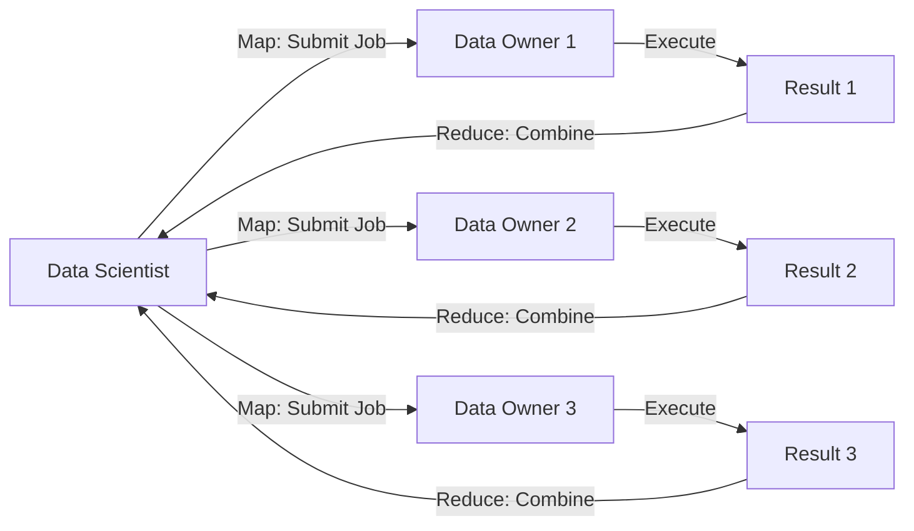

A **datasite** is a peer in the Syft network - a folder on a user's local filesystem that contains their data, permissions, and shared state.

## What is a Datasite?

Each datasite is identified by an **email address** and contains:

- **Private data**: Files accessible only to the owner
- **Public/shared data**: Files shared with specific peers or everyone
- **Permission files** (`syft.pub.yaml`): Define who can access what
- **Job queues**: Incoming computation requests from peers
- **Event logs**: History of all state changes

### Datasite Structure

```
~/syftbox/
├── alice@example.com/              # Alice's datasite
│   ├── public/                     # Public folder
│   │   ├── syft.pub.yaml          # Permissions: read = ["*"]
│   │   ├── datasets/              # Shared datasets
│   │   └── mock_data.csv          # Mock data for testing
│   ├── private/                    # Private folder (owner only)
│   │   ├── syft.pub.yaml          # Permissions: read = ["alice@example.com"]
│   │   └── sensitive_data.csv
│   ├── jobs/                       # Job queue
│   │   └── bob@example.com/       # Jobs from Bob
│   │       └── analysis_job_123/
│   │           ├── run.sh
│   │           ├── config.yaml
│   │           └── approved       # Status marker
│   └── api_data/                  # Shared with specific peers
│       ├── syft.pub.yaml          # Permissions: read = ["bob@example.com"]
│       └── results.json
└── bob@example.com/                # Bob's datasite (synced copy)
    └── public/
        └── his_mock_data.csv
```

<Info>
Following **Principle 1: File first**, the datasite folder **is** the state. No database required - everything is visible as files.
</Info>

## Two Core Roles

Syft defines two personas that collaborate through datasites:

<CardGroup cols={2}>
  <Card title="Data Owner" icon="database">
    Has private data and receives computation requests. Reviews and approves jobs before execution.
  </Card>
  <Card title="Data Scientist" icon="chart-line">
    Wants to run analysis on others' data. Submits jobs and receives results/mocks.
  </Card>
</CardGroup>

<Note>
The same user can be **both** a data owner (for their own data) and a data scientist (when requesting others' data). Roles are contextual, not fixed.
</Note>

## Data Owner Workflow

As a data owner, you:

1. **Store private data** in your datasite
2. **Create mocks** for data scientists to develop against
3. **Set permissions** controlling who can access what
4. **Receive job requests** from data scientists
5. **Review and approve/reject** jobs manually or via policies
6. **Execute approved jobs** in isolated environments
7. **Share results** back through the network

### Data Owner Components

<CodeGroup>
```python syft_client/sync/sync/datasite_owner_syncer.py
class DatasiteOwnerSyncer(BaseModelCallbackMixin):
    """Responsible for downloading files and checking permissions"""
    
    def sync(self, peer_emails: list[str], recompute_hashes: bool = True):
        """Pull proposed file changes from peers"""
        for peer_email in peer_emails:
            msg = self.pull_and_process_next_proposed_filechange(peer_email)
            if msg:
                self.handle_proposed_filechange_events_message(peer_email, msg)
    
    def check_write_permission(self, sender_email: str, path: str) -> bool:
        """Check if sender has write access to the given path"""
        self.perm_context._reload()
        return self.perm_context.open(path).has_write_access(sender_email)
    
    def handle_proposed_filechange_events_message(
        self, sender_email: str, proposed_events_message: ProposedFileChangesMessage
    ):
        # Filter to only changes sender has permission to make
        allowed_changes = [
            change for change in proposed_events_message.proposed_file_changes
            if self.check_write_permission(sender_email, str(change.path_in_datasite))
        ]
        
        if allowed_changes:
            # Process and accept allowed changes
            self.event_cache.process_proposed_events_message(...)
```
</CodeGroup>

**Key responsibilities:**
- Pull incoming messages from peers
- Check write permissions on all proposed changes
- Process only allowed file changes
- Maintain event history and checkpoints

### Job Approval

Jobs can be approved:

<Tabs>
  <Tab title="Manual Review">
    Following **Principle 7: Manual-review-first**, the default is manual approval:
    
    ```python
    from syft_job import get_client
    
    client = get_client("/path/to/syftbox", "alice@example.com")
    
    # View pending jobs
    for job in client.jobs:
        if job.status == "inbox":
            print(f"Job from {job.submitted_by}: {job.name}")
            # Review job contents
            print(open(job.location / "run.sh").read())
            
            # Approve if safe
            job.approve()
    ```
  </Tab>
  
  <Tab title="Job Policies">
    Automatic approval when jobs match specific criteria:
    
    ```python
    from syft_client.job_auto_approval import create_approval_policy
    
    # Auto-approve jobs matching exact script from specific users
    policy = create_approval_policy(
        required_scripts={"run.sh": "#!/bin/bash\necho 'hello'"},
        allowed_users=["bob@example.com"],
        auto_approve=True
    )
    
    # Policy runs automatically in background
    ```
    
    See job auto-approval in `syft_client/job_auto_approval.py`
  </Tab>
</Tabs>

<Warning>
Following **Principle 2: File-permission-first, job-policy second**, no other permission system exists. All access control is through file permissions or job policies.
</Warning>

## Data Scientist Workflow

As a data scientist, you:

1. **Discover data owners** (through SyftHub or other channels)
2. **Request peer connection** and get approved
3. **Access mock data** to develop and test your analysis
4. **Submit jobs** to run analysis on real data
5. **Wait for approval** (manual or policy-based)
6. **Receive results** when job completes

### Data Scientist Components

<CodeGroup>
```python syft_client/sync/sync/datasite_watcher_syncer.py
class DatasiteWatcherSyncer(BaseModelCallbackMixin):
    """Handles both pushing proposed file changes and pulling from datasite outboxes."""
    
    def on_file_change(
        self, relative_path: Path | str, content: str | None = None, process_now=True
    ):
        """Queue file change for syncing to peer"""
        relative_path = Path(relative_path)
        self.queue.put((relative_path, content))
        if process_now:
            self.process_file_changes_queue()
    
    def sync_down(self, peer_emails: list[str]):
        """Pull messages and datasets from peer outboxes"""
        for peer_email in peer_emails:
            # Sync messages with parallel download
            self.datasite_watcher_cache.sync_down_parallel(
                peer_email,
                self._executor,
                self.download_events_message_with_new_connection,
            )
```
</CodeGroup>

**Key responsibilities:**
- Monitor local file changes
- Push proposed changes to peer inboxes
- Pull results from peer outboxes
- Cache remote datasets locally

### Submitting Jobs

<CodeGroup>
```python Bash Script
from syft_job import get_client

client = get_client("/path/to/syftbox", "bob@example.com")

# Submit bash job to data owner
script = """
#!/bin/bash
set -e
python analysis.py
"""

job_dir = client.submit_bash_job(
    user="alice@example.com",
    script=script,
    job_name="My Analysis"
)
print(f"Job submitted to: {job_dir}")
```

```python Python Script
from syft_job import get_client

client = get_client("/path/to/syftbox", "bob@example.com")

# Submit Python job with dependencies
job_dir = client.submit_python_job(
    user="alice@example.com",
    code_path="./my_analysis.py",
    job_name="Analysis v2",
    dependencies=["pandas==2.0.0", "numpy"]
)
print(f"Job submitted to: {job_dir}")
```
</CodeGroup>

Jobs are written to `alice@example.com/jobs/bob@example.com/job_name/` and synced via the transport layer.

## Mock Data

Following **Principle 15: Mock-always**, every piece of state comes with a mock:

<Steps>
  <Step title="Data Owner Creates Mock">
    Owner provides mock data for scientists to develop against:
    
    ```python
    # Real data (private)
    ~/syftbox/alice@example.com/private/customers.csv
    
    # Mock data (public)
    ~/syftbox/alice@example.com/public/customers_mock.csv
    ```
  </Step>
  
  <Step title="Data Scientist Develops Locally">
    Scientists write and test code against mock data:
    
    ```python
    import pandas as pd
    
    # Develop using mock data
    df = pd.read_csv("/syftbox/alice@example.com/public/customers_mock.csv")
    result = df.groupby("region").sum()
    result.to_csv("output.csv")
    ```
  </Step>
  
  <Step title="Submit Job to Real Data">
    Submit the tested code to run on real private data:
    
    ```python
    client.submit_python_job(
        user="alice@example.com",
        code_path="analysis.py",
        job_name="Regional Analysis"
    )
    ```
    
    The same code runs, but reads from `private/customers.csv` on Alice's machine.
  </Step>
</Steps>

<Info>
Following **Principle 16: Automock-first**, mock generation should be automatic. Manual mocks are fallback when privacy norms are unclear.
</Info>

## MapReduce Model

Following **Principle 11: MapReduce-first**, all interactions are viewed through the MapReduce lens:



**Map phase**: Submit same job to multiple data owners  
**Reduce phase**: Aggregate results locally

```python
# Map: Submit to multiple data owners
data_owners = ["alice@example.com", "bob@example.com", "carol@example.com"]
jobs = []

for owner in data_owners:
    job_dir = client.submit_python_job(
        user=owner,
        code_path="count_customers.py",
        job_name=f"Count for {owner}"
    )
    jobs.append((owner, job_dir))

# Wait for results...

# Reduce: Aggregate results
total = 0
for owner, job_dir in jobs:
    result = pd.read_csv(job_dir / "outputs" / "count.csv")
    total += result["count"].sum()

print(f"Total customers across all owners: {total}")
```

## Single Gateway

Following **Principle 17: Single-gateway only**, there is only one job queue per datasite:

- Data owners can see **everything** entering/leaving their datasite
- No hidden channels or backdoors
- Full transparency for data owners

```
alice@example.com/
└── jobs/                    # THE ONLY GATEWAY
    ├── bob@example.com/     # All jobs from Bob
    ├── carol@example.com/   # All jobs from Carol
    └── dave@example.com/    # All jobs from Dave
```

<Warning>
Even what looks like RPC or state queries goes through the job queue under the hood (**Principle 18: Job-only**).
</Warning>

## Client-First Debugging

Following **Principle 8: DataScientist-first-debugging**, when something goes wrong, the data scientist does the work:

<Steps>
  <Step title="Job Fails">
    Job executes but produces an error:
    
    ```python
    job = client.jobs["My Analysis"]
    print(job.status)  # "done"
    print(job.stderr.text)
    # Traceback: KeyError: 'customer_id'
    ```
  </Step>
  
  <Step title="Review Error Locally">
    Data scientist reviews error and fixes code:
    
    ```python
    # Fix the code
    df = pd.read_csv("data.csv")
    df = df.rename(columns={"id": "customer_id"})  # Fix!
    ```
  </Step>
  
  <Step title="Resubmit">
    Submit fixed version:
    
    ```python
    client.submit_python_job(
        user="alice@example.com",
        code_path="analysis_fixed.py",
        job_name="My Analysis v2"
    )
    ```
  </Step>
</Steps>

**Not** the data owner's job to:
- Normalize their data to match scientist's expectations
- Debug scientist's code
- Coordinate with other data owners

The scientist adapts to each data owner's schema (using mocks).

## Fail Softly

Following **Principle 6: Fail-softly**, jobs don't get rejected - they produce errors:

<Tabs>
  <Tab title="Traditional API">
    ```python
    # Traditional: Hard failure
    response = api.query("/customers/count")
    # 404 Not Found - endpoint doesn't exist
    # ❌ No debugging info
    ```
  </Tab>
  
  <Tab title="Syft Job">
    ```python
    # Syft: Soft failure
    job = client.submit_bash_job(
        user="alice@example.com",
        script="cat customers.csv | wc -l"
    )
    
    # Job runs, produces error
    print(job.stderr.text)
    # cat: customers.csv: No such file or directory
    # ✅ Full debugging context!
    ```
    
    The data scientist can now adapt:
    ```python
    # Try different path
    script = "cat private/customers.csv | wc -l"
    ```
  </Tab>
</Tabs>

With data owner's permission, the scientist can see **why** it failed and fix it.

## Datasite Configuration

Datasites are created and configured through the permission system:

```python
from syft_perm import SyftPermContext

# Initialize datasite
datasite = Path("/path/to/syftbox/alice@example.com")
ctx = SyftPermContext(datasite=datasite)

# Set up folder permissions
public_folder = ctx.open("public/")
public_folder.grant_read_access("*")  # Everyone can read

private_folder = ctx.open("private/")
private_folder.grant_read_access("alice@example.com")  # Owner only

api_folder = ctx.open("api_data/")
api_folder.grant_read_access("bob@example.com")  # Specific peer
api_folder.grant_write_access("bob@example.com")  # Can write back results
```

See [Permissions](/concepts/permissions) for details.

## Next Steps

<CardGroup cols={2}>
  <Card title="Permissions" icon="lock" href="/concepts/permissions">
    Learn about file-first access control
  </Card>
  <Card title="Job System" icon="play" href="/guides/submit-jobs">
    Submit and manage jobs
  </Card>
  <Card title="Datasets" icon="database" href="/guides/share-datasets">
    Share datasets between datasites
  </Card>
  <Card title="P2P Network" icon="network-wired" href="/concepts/peer-to-peer">
    Understand transport layers and sync
  </Card>
</CardGroup>