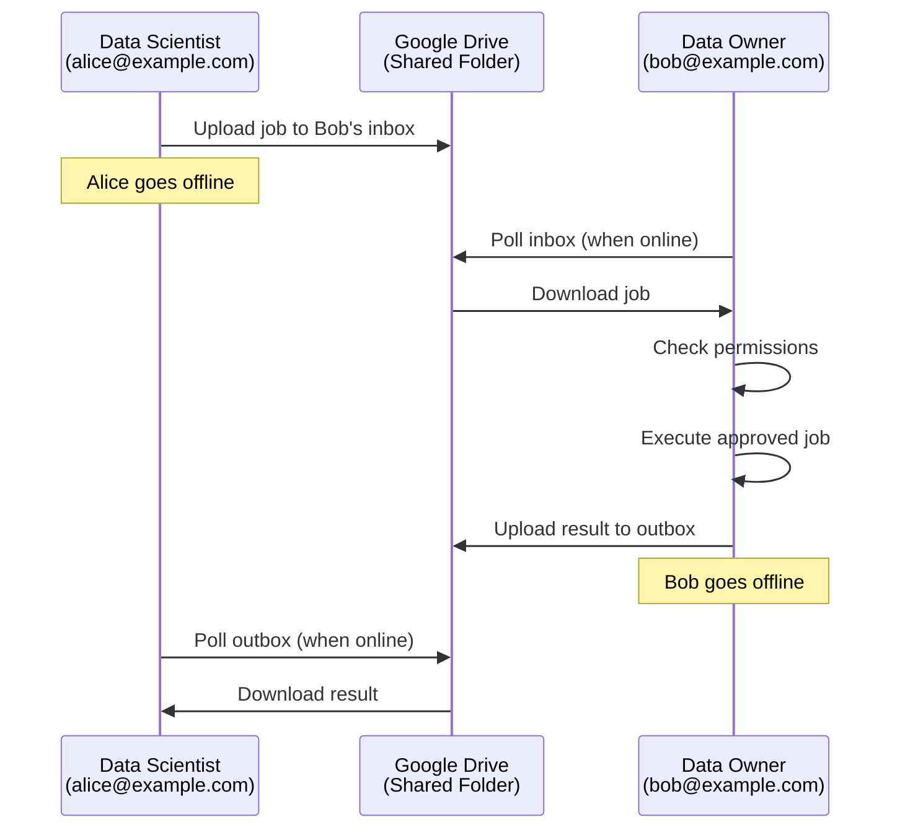

Syft Client uses a **peer-to-peer (P2P)** architecture where datasites communicate directly through shared transport layers, without requiring a central server.

## Core P2P Principles

<CardGroup cols={2}>
  <Card title="Offline First" icon="wifi-slash">
    **Principle 3**: Datasites can go offline/online freely. Messages cache in transport layers until peers reconnect.
  </Card>
  <Card title="Transport Agnostic" icon="plug">
    **Principle 13**: Works with any transport layer. Any means of getting messages between uniquely addressed users works.
  </Card>
  <Card title="Transport-Based Auth" icon="key">
    **Principle 14**: Identity bootstrapped from existing transport authentication (Google, Microsoft, etc.).
  </Card>
  <Card title="Peer First" icon="users">
    **Principle 9**: Like Signal - only communicate with explicitly authorized contacts. No global discovery.
  </Card>
</CardGroup>

## How P2P Communication Works

Syft's P2P model is **asynchronous** and **message-based**:



<Note>
Both peers can be offline at different times. The transport layer (Google Drive) acts as a **persistent message queue**.
</Note>

## Transport Layers

Syft supports multiple transport layers. Each implements the same `SyftboxPlatformConnection` interface:

<CodeGroup>
```python syft_client/sync/connections/base_connection.py
class SyftboxPlatformConnection(BaseModel):
    """Base interface for all transport layers"""
    
    def send_proposed_file_changes_message(
        self, proposed_file_change_message: ProposedFileChangesMessage
    ):
        """Send a message to peer's inbox"""
        raise NotImplementedError()
    
    def create_dataset_collection_folder(
        self, tag: str, content_hash: str, owner_email: str
    ) -> str:
        """Create a shared dataset collection"""
        raise NotImplementedError()
    
    def share_dataset_collection(
        self, tag: str, content_hash: str, users: list[str]
    ) -> None:
        """Share dataset with specific users"""
        raise NotImplementedError()
```
</CodeGroup>

### Supported Transport Layers

<AccordionGroup>
  <Accordion title="Google Drive (Google Workspace)" icon="google" defaultOpen={true}>
    The primary reference implementation. Uses shared folders for inbox/outbox messaging.
    
    **Structure:**
    ```
    Google Drive (Shared with peer)
    ├── inbox/                    # Incoming messages from peer
    │   └── proposed_changes_*.tar.gz
    ├── outbox/                   # Outgoing messages to peer  
    │   └── events_*.tar.gz
    ├── datasets/                 # Shared dataset collections
    └── checkpoints/              # State checkpoints
    ```
    
    **Authentication:** Uses existing Google account authentication.
  </Accordion>
  
  <Accordion title="Dropbox" icon="dropbox">
    Alternative cloud storage transport. Same message structure as Google Drive.
  </Accordion>
  
  <Accordion title="Microsoft 365 (OneDrive)" icon="microsoft">
    Enterprise-friendly transport using OneDrive shared folders.
  </Accordion>
  
  <Accordion title="Custom Transports" icon="code">
    Any system that can move files between users can be a transport:
    - WebRTC for ephemeral, real-time sync (when both online)
    - S3 buckets with shared access
    - IPFS for decentralized storage
    - Email attachments (for low-volume use)
  </Accordion>
</AccordionGroup>

<Warning>
Transport layers must support:
1. **Persistent storage** (messages survive restarts)
2. **Unique addressing** (can identify sender/recipient)
3. **Atomic writes** (file uploads complete fully)
</Warning>

## Connection Router

The `ConnectionRouter` abstracts transport layer complexity:

<CodeGroup>
```python syft_client/sync/connections/connection_router.py
class ConnectionRouter:
    """Routes messages to appropriate transport layers"""
    
    def __init__(self, connections: List[SyftboxPlatformConnection]):
        self.connections = connections
    
    @classmethod
    def from_configs(cls, connection_configs: List[ConnectionConfig]):
        """Create router from configuration"""
        connections = [
            config.connection_type.from_config(config) 
            for config in connection_configs
        ]
        return cls(connections=connections)
    
    def send_proposed_file_changes_message(
        self, recipient: str, message: ProposedFileChangesMessage
    ):
        """Send message via first available connection"""
        self.connections[0].send_proposed_file_changes_message(message)
    
    def get_next_proposed_filechange_message(
        self, sender_email: str
    ) -> ProposedFileChangesMessage | None:
        """Pull next message from inbox"""
        return self.connections[0].get_next_proposed_filechange_message(sender_email)
```
</CodeGroup>

This allows switching transport layers without changing application code.

## Peer Management

Peers are defined by their email address and available platforms:

<CodeGroup>
```python syft_client/sync/peers/peer.py
class PeerState(str, Enum):
    ACCEPTED = "accepted"      # Peer connection approved
    PENDING = "pending"        # Awaiting approval from peer
    REJECTED = "rejected"      # Connection rejected
    OUTSTANDING = "outstanding"  # Outgoing request sent

class Peer(BaseModel):
    email: str
    platforms: List[BasePlatform] = []  # Available transport layers
    state: PeerState = PeerState.ACCEPTED
    version: Optional[VersionInfo] = None
    
    @property
    def is_approved(self) -> bool:
        return self.state == PeerState.ACCEPTED
```
</CodeGroup>

### Peer Discovery

Following **Principle 9: Peer-first**, discovery happens **outside** the protocol:

1. Find peers on SyftHub or other discovery services
2. Exchange contact information (email addresses)
3. Manually add peers to your contact list
4. Request connection (peer must approve)

This privacy-preserving approach means:
- No global peer registry
- No one can discover you without permission
- Like Signal's contact model

## Offline-First Sync

### Message Queuing

When a peer is offline, messages accumulate in the transport layer:

<Steps>
  <Step title="Data Scientist Submits Job">
    Alice submits a job to Bob while Bob is offline.
    
    ```python
    # Alice's side
    client.submit_python_job(
        user="bob@example.com",
        code_path="analysis.py"
    )
    # Message uploaded to Google Drive inbox
    ```
  </Step>
  
  <Step title="Message Cached in Transport">
    The job is stored in Bob's inbox folder on Google Drive. It persists indefinitely.
  </Step>
  
  <Step title="Data Owner Comes Online">
    Bob's `DatasiteOwnerSyncer` polls the inbox when he comes back online.
    
    ```python
    # Bob's side (runs automatically)
    syncer.sync(peer_emails=["alice@example.com"])
    # Pulls all pending messages from Alice
    ```
  </Step>
  
  <Step title="Process and Respond">
    Bob processes the job, executes it, and uploads results to his outbox. Alice can retrieve them whenever she's online.
  </Step>
</Steps>

### Sync Strategies

<Tabs>
  <Tab title="Periodic Polling">
    Default strategy: Check for new messages every N seconds.
    
    ```python
    # Data owner polls inbox
    while True:
        syncer.sync(peer_emails=approved_peers)
        time.sleep(sync_interval)
    ```
    
    **Pros:** Simple, works offline  
    **Cons:** Higher latency
  </Tab>
  
  <Tab title="Event-Driven (When Available)">
    Use transport layer notifications (e.g., Google Drive API webhooks) to trigger sync.
    
    ```python
    # React to transport events
    def on_transport_change(event):
        if event.type == "new_file":
            syncer.sync(peer_emails=[event.sender])
    ```
    
    **Pros:** Lower latency, efficient  
    **Cons:** Requires online connection
  </Tab>
  
  <Tab title="Hybrid (Recommended)">
    Combine both: event-driven when online, periodic polling as fallback.
    
    ```python
    # Best of both worlds
    transport.on_change(lambda e: syncer.sync([e.sender]))
    
    # Fallback polling for missed events
    schedule.every(5).minutes.do(lambda: syncer.sync(all_peers))
    ```
  </Tab>
</Tabs>

## Message Format

All P2P messages use the `FileChangeEventsMessage` format:

<CodeGroup>
```python syft_client/sync/events/file_change_event.py
class FileChangeEventsMessage(BaseModel):
    events: List[FileChangeEvent]
    
    @property
    def message_filepath(self) -> FileChangeEventsMessageFileName:
        """Generate unique filename for this message"""
        return FileChangeEventsMessageFileName(
            id=uuid4(),
            timestamp=create_event_timestamp()
        )
        # Returns: syfteventsmessagev3_{timestamp}_{uuid}.tar.gz
```
</CodeGroup>

Each event describes a single file change:

```python
class FileChangeEvent(BaseModel):
    id: UUID
    path_in_datasite: Path        # Relative path in recipient's datasite
    datasite_email: str           # Owner of the datasite
    content: str | bytes | None   # File contents (or None for deletion)
    old_hash: str | None
    new_hash: str | None
    is_deleted: bool
    submitted_timestamp: float    # When submitted
    timestamp: float              # When accepted
```

## Ephemeral Transports (Future)

While the core is offline-first, faster transports can be used when **both peers are online**:

- **WebRTC**: Direct peer-to-peer connection for real-time sync
- **WebSockets**: Server-mediated real-time messaging
- **QUIC**: Modern UDP-based protocol

<Note>
Ephemeral transports are **optional upgrades**, not the foundation. The system must always work with persistent, offline-capable transports.
</Note>

## Security Model

### Transport Layer Security

Security is bootstrapped from existing transport authentication:

<Steps>
  <Step title="Authentication">
    Use transport layer's auth (Google OAuth, Microsoft Azure AD, etc.)
  </Step>
  <Step title="Channel Identity">
    "A user is a channel I can send messages to" - email address defines identity
  </Step>
  <Step title="Optional Encryption">
    Exchange keys over authenticated channels for end-to-end encryption
  </Step>
  <Step title="Insecure Transports">
    Can protect insecure transports with keys exchanged offline
  </Step>
</Steps>

### Permission Enforcement

Even with transport access, file permissions are checked:

```python
# From datasite_owner_syncer.py:637
def handle_proposed_filechange_events_message(
    self, sender_email: str, proposed_events_message: ProposedFileChangesMessage
):
    # Filter to only allowed changes
    allowed_changes = [
        change for change in proposed_events_message.proposed_file_changes
        if self.check_write_permission(sender_email, str(change.path_in_datasite))
    ]
    
    if not allowed_changes:
        return  # Reject all changes
```

See [Permissions](/concepts/permissions) for details.

## Performance Optimizations

### Parallel Downloads

Syncers use thread pools for parallel downloads:

```python
# From datasite_watcher_syncer.py:43
_executor: ThreadPoolExecutor = PrivateAttr(
    default_factory=lambda: ThreadPoolExecutor(max_workers=10)
)

def sync_down(self, peer_emails: list[str]):
    for peer_email in peer_emails:
        # Parallel download of multiple messages
        self.datasite_watcher_cache.sync_down_parallel(
            peer_email,
            self._executor,
            self.download_events_message_with_new_connection,
        )
```

### Checkpointing

To avoid downloading all historical events, Syft uses checkpoints:

- **Full checkpoints**: Complete state snapshots
- **Incremental checkpoints**: Delta updates since last checkpoint
- **Rolling state**: In-memory accumulation of recent events

See [Architecture](/concepts/architecture#state-management) for checkpoint details.

## Next Steps

<CardGroup cols={2}>
  <Card title="Architecture" icon="diagram-project" href="/concepts/architecture">
    Understand the overall system design
  </Card>
  <Card title="Datasites" icon="server" href="/concepts/datasites">
    Learn about data owner and data scientist roles
  </Card>
  <Card title="Permissions" icon="shield" href="/concepts/permissions">
    Explore file-based access control
  </Card>
  <Card title="Set Up Sync" icon="rotate" href="/getting-started/sync">
    Configure sync with transport layers
  </Card>
</CardGroup>